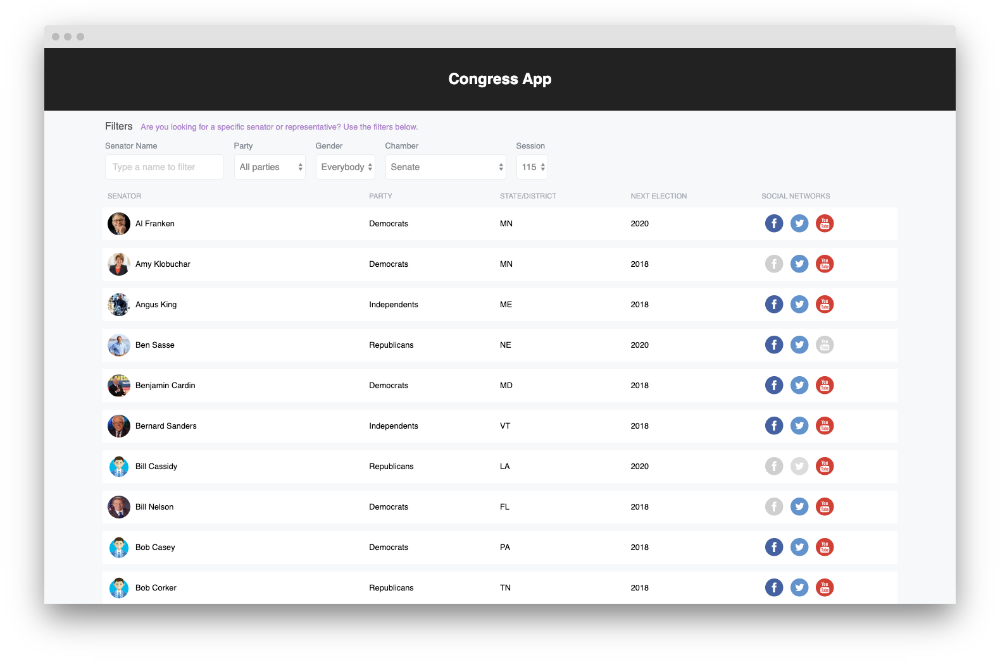

# Congress App

> Disclaimer: This project is not actively maintained. It was developed for an interview test for my application to [Ubiquity6](https://ubiquity6.com/). The period requested to keep my source code private has already expired, so, I've open sourced it.

> This project demonstrates some of my practices and style of coding a web application with React and TypeScript. Please note that this project was developed on January 2019 and I've improved several of my practices since then. I may eventually revamp the project with newest practices as well as more features from the awesome data supplied by ProPublica's API.

This application queries the [ProPublica Congress API](https://projects.propublica.org/api-docs/congress-api/members/#lists-of-members) to list Senators and Representatives of the US government.

Clicking on members of either chambers will show all details supplied by the ProPublica's API, such as the member's party, social networks, news, office location map, along with a list of committees and sub-commitees.

Check out a live copy of this project at https://congressapp.surge.sh/

# Development

To run this project locally, follow these steps:

1. Clone this repository with `git clone https://github.com/fmoliveira/congress-app.git`
2. Make a copy of the file `.env.example` named `.env` and fill it with your credentials from ProPublica Congress API and Google Maps JavaScript API
3. Install the dependencies with the command `yarn`
4. Run the project with `yarn start`
5. Access it locally at http://localhost:3000/

# License

MIT
